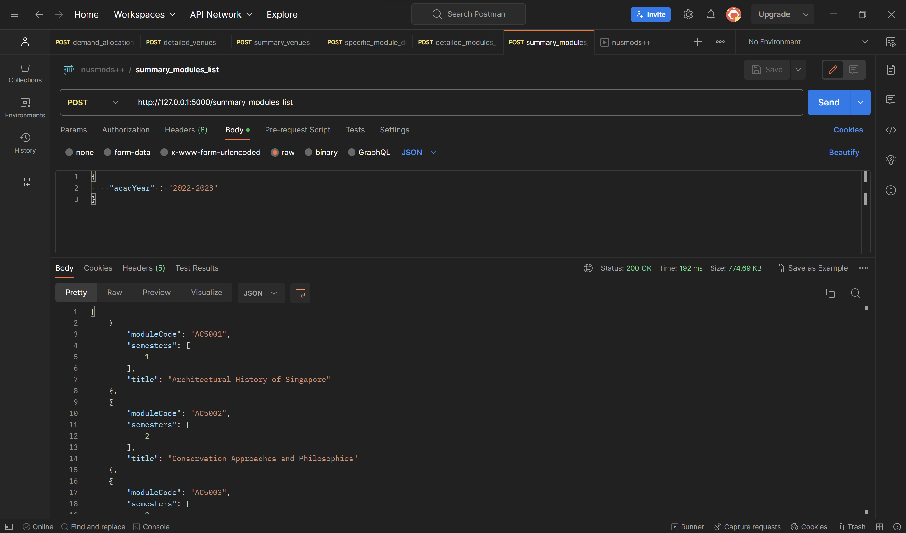
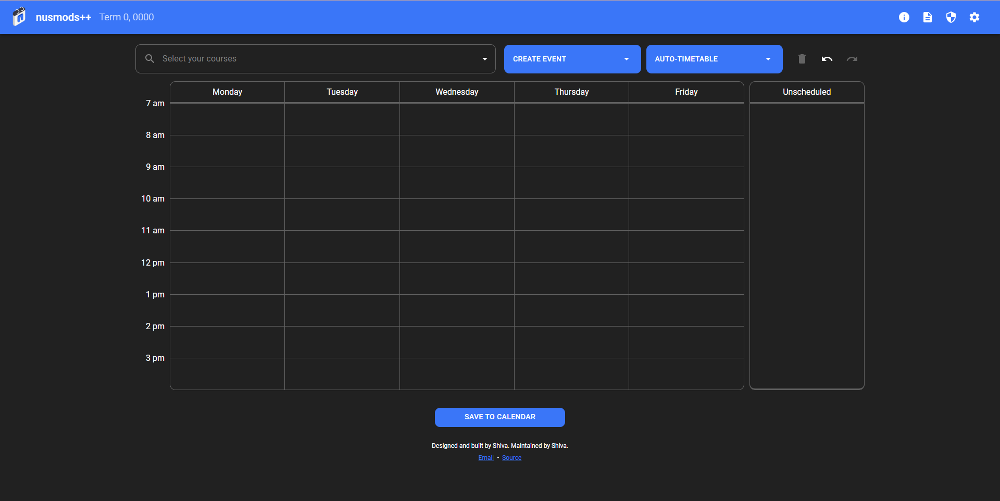

# nusmods++
- a react and flask app

## Purpose

Creating a timtable for every semester for every round is very mentally draining and a challenging task. It involves parsing multiple PDFs for every round, comparing trends, and examining the classes available. This project aims to streamline this process by creating a more user frindly UI with drag and drop, saving past timetables for

